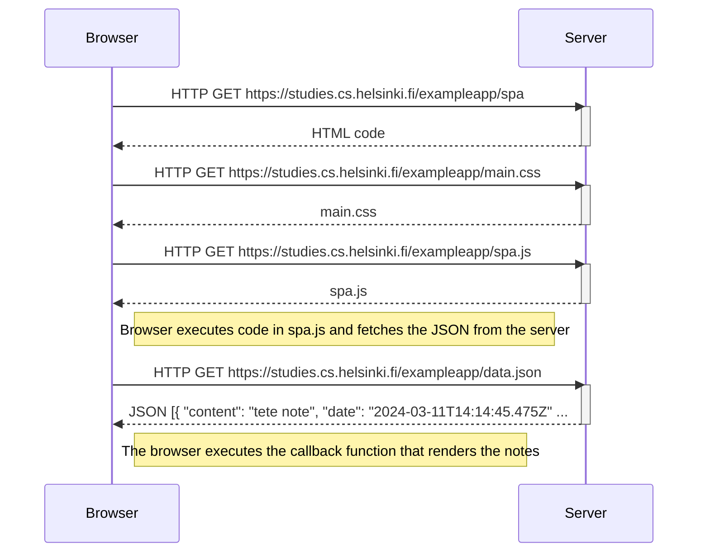

```mermaid
sequenceDiagram

participant A as Browser
participant B as Server

A ->> B :HTTP GET https://studies.cs.helsinki.fi/exampleapp/spa
activate B
B -->> A : HTML code
deactivate B

A ->> B: HTTP GET https://studies.cs.helsinki.fi/exampleapp/main.css
activate B
B -->> A : main.css
deactivate B

A ->> B : HTTP GET https://studies.cs.helsinki.fi/exampleapp/spa.js
activate B
B -->> A: spa.js
deactivate B

Note right of A: Browser executes code in  spa.js and  fetches the JSON from the server

A ->> B : HTTP GET https://studies.cs.helsinki.fi/exampleapp/data.json
activate B
B -->> A: JSON  [{ "content": "tete note",  "date": "2024-03-11T14:14:45.475Z" ...
deactivate B

Note right of A: The browser executes the callback function that renders the notes 
```
